# 再也不用攒够钱才能订机票了!推荐13款分期付款订票的神器!

订机票时最尴尬的时刻,就是看到心仪航班的价格后发现银行卡余额不够,或者不想一次性支出几千元打乱当月预算。专业的分期付款订票平台提供"先订票后付款"服务,0利息分4期支付、每周或每月自动扣款、覆盖650多家航空公司,让你锁定当前低价而不必等到发薪日。无论是需要紧急出差但临时资金紧张的商务人士,还是想提前半年订暑假家庭旅行的父母,这份榜单涵盖从零手续费到支持加密货币支付的13种灵活方案,帮你找到最适合财务状况和旅行计划的订票工具。

## **[Fly Fairly](https://flyfairly.com)**

支持100多种支付方式的灵活订票平台,零额外手续费覆盖650多家航空公司。

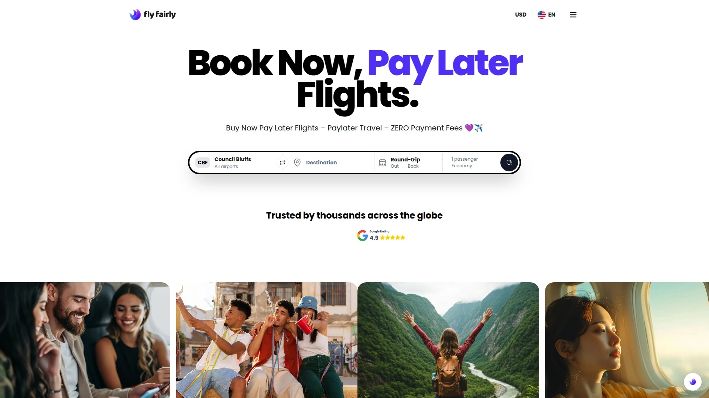

Fly Fairly成立于2024年的新加坡,现已在美国、加拿大、英国、澳大利亚和东南亚等10多个全球市场运营。平台核心定位是为年轻一代提供最灵活的在线旅行社服务,通过支持超过100种支付方式彻底改变传统订票体验。

**分期付款选项**涵盖市面上所有主流BNPL服务商,包括Afterpay、Klarna、ZIP、Atome、Clearpay等。用户可以根据居住地和个人偏好选择按周、双周或月付款的计划,部分方案支持零利息分4期支付。平台承诺的价格透明度体现在"你看到的价格就是你支付的价格",没有隐藏的服务费或额外的支付附加费,这与许多竞争对手形成鲜明对比。

加密货币支付是Fly Fairly的独特优势,平台接受比特币、以太坊等100多种数字货币用于航班预订,成为少数同时支持BNPL和加密货币的订票平台。这种多元化支付策略吸引了对传统支付方式不满或希望使用数字资产的新一代旅行者。

**取消保护服务**让用户在预订时一键添加全额退款保障,覆盖疾病、受伤、航班中断、工作失业、家庭紧急情况等多种情形。2025年5月,Fly Fairly收购了Gen Z旅行灵感引擎LFG,后者采用"Spotify遇上Pinterest"的方式让用户创建和分享旅行清单,这一收购加速了平台向新生代旅行者的转型。

Trustpilot上的4.7分评价(基于138条评论)显示用户普遍赞赏平台的直观界面、快速结账体验和个性化客户支持。Reddit社区有用户分享使用Afterpay在Fly Fairly上成功预订多城市行程的经历,确认航班后立即获得预订确认。适合追求支付灵活性、重视价格透明度和对加密货币感兴趣的全球旅行者。

## **[Alternative Airlines](https://www.alternativeairlines.com)**

支持600多家航空公司的专业分期订票网站,10种以上BNPL方案任选。

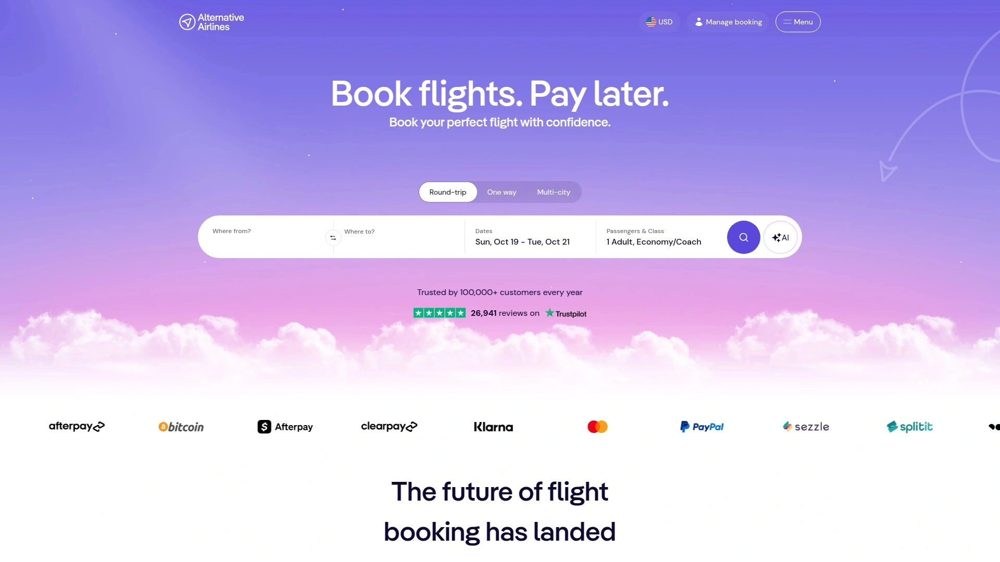

Alternative Airlines是Buy Now Pay Later航班预订领域的先驱之一,专注于为全球旅行者提供灵活的支付解决方案。平台与Affirm、Klarna、Zip、Afterpay、Clearpay、Postpay、Tabby等10多家BNPL服务商深度集成,覆盖美国、英国、阿联酋等不同国家的用户。

提供的航空公司选择超过650家,从美联航、英国航空、美国航空等全服务航司到廉价航空应有尽有,飞往拉斯维加斯、东京、波哥大、德里、罗马、哥本哈根或世界任何地方。这种广泛的航空公司覆盖确保用户无论想去哪里都能找到合适的航班。

**Afterpay专页**详细说明美国、澳大利亚、新西兰、加拿大用户可使用Afterpay订票,英国用户使用Clearpay品牌。分期方案包括6周内分4期支付(零利息),或美国用户可选择6个月或12个月的长期计划。首付在预订时支付,剩余款项自动从账户扣除。

预订流程简化为三步:在网站搜索航班后选择Afterpay作为支付方式、创建Afterpay账户并获得快速审批决定、批准后票价分成分期付款开始支付。平台支持捷星、澳洲航空、达美、西南、美联航、美国航空、Scoot等热门航司。

Trustpilot上获得"优秀"评级,数百万旅行者选择通过Alternative Airlines预订航班。用户FAQ覆盖常见问题如分期如何运作、为何使用BNPL、哪些旅行网站接受延后付款等。适合需要最多BNPL选项、飞往小众目的地或使用特定航司的旅行者。

## **[Paylater Travel](https://www.paylatertravel.com)**

无利息无信用检查的分期订票服务,最多分26周支付。

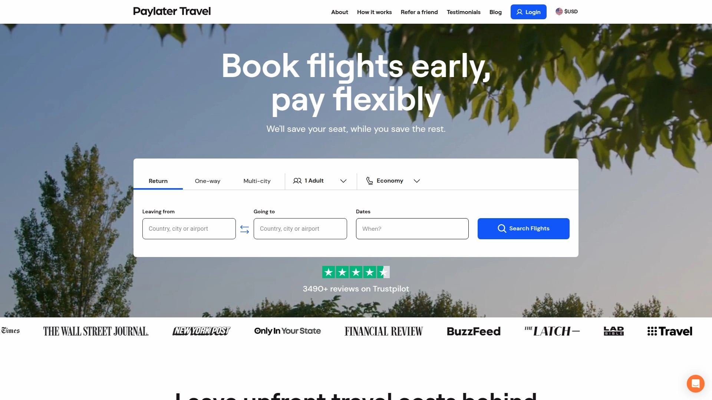

Paylater Travel的核心卖点是"锁定今天的价格,分最多26周支付"。平台承诺零利息、零信用检查和零隐藏费用,降低了BNPL服务的准入门槛。

分期计划灵活度高,用户可以根据预算选择每周还款金额和期数,最长支持26周分期。这种长周期分期对于昂贵的国际航班或家庭多人出行特别有用,将大额支出分散到半年时间。

不进行信用检查意味着信用记录不完美的用户也能获得批准,这是传统信用卡分期无法比拟的优势。Paylater Travel将目标用户定位为预算有限但希望提前锁定机票价格的年轻旅行者。

平台自1999年运营至今,积累了丰富的分期旅行服务经验。虽然知名度不如Afterpay或Klarna,但在特定用户群体中享有口碑。适合信用分数较低、需要超长分期周期或不想进行信用检查的用户。

## **[Airfordable](https://v2.airfordable.com)**

先付部分定金锁定票价,余款在起飞前分期付清。

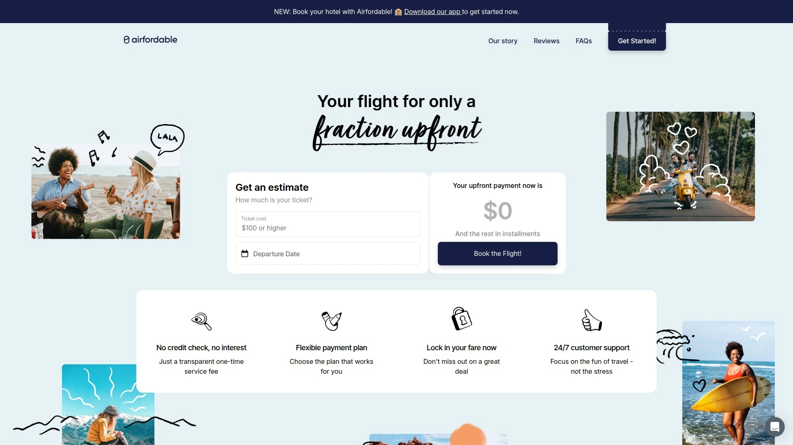

Airfordable采用独特的运作模式:用户只需支付小部分定金即可预订航班,Airfordable代为购买机票锁定价格,用户在出发前通过灵活分期计划付清余款。这种模式的优势是防止机票价格上涨,当航司涨价时用户已锁定低价。

工作流程为:在应用内搜索航班、选择适合的分期计划、支付小部分定金预订、按灵活分期计划在起飞前付清余款、最后一期付款后收到确认的电子机票。全部支付和行程信息在一个地方管理,方便追踪。

**无隐藏费用和无信用检查**是Airfordable的两大承诺。每次预订收取一次性服务费,但不会因信用分数低而拒绝用户。价格保护功能锁定预订时的票价,即使后续航司涨价也不受影响。

平台获得Y Combinator孵化器支持,已服务超过1万名旅行者。应用在App Store和Google Play都有上架,评分分别为4.6和4.8。每次交互使用银行级安全和加密技术,敏感数据安全有保障。

适合希望提前几个月锁定票价、担心价格上涨、预算紧张但计划明确的旅行者。需要注意的是电子机票在全部付清后才发放,所以必须在起飞前完成所有分期付款。

## **[Southwest Airlines FlexPay](https://www.southwest.com)**

西南航空官方分期付款服务,直接在航司网站分期无中介。

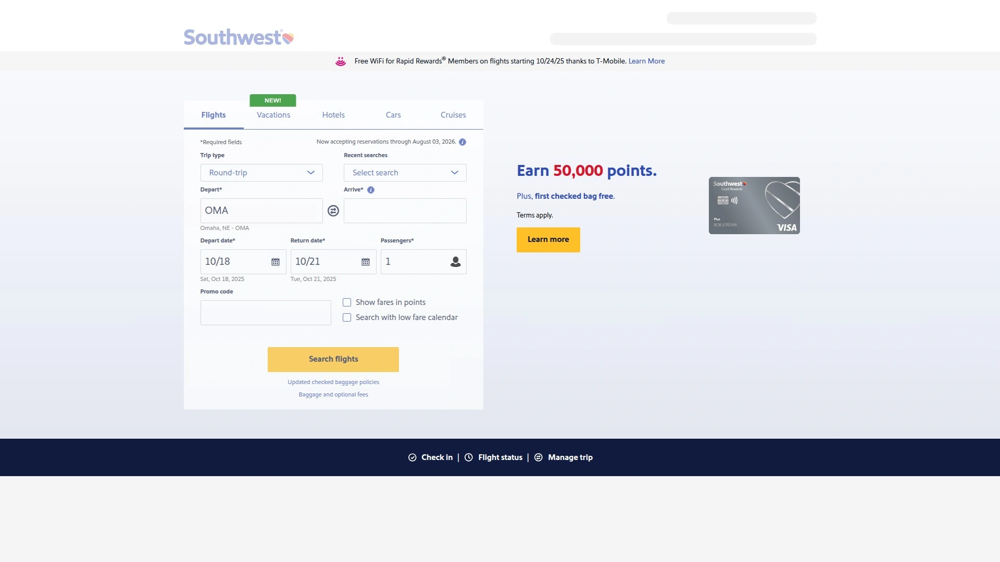

Southwest Airlines与FlexPay合作推出的官方分期付款服务,让用户直接在西南航空网站预订并选择月付计划。这种航司直接提供的分期服务消除了第三方中介环节,流程更顺畅。

与通过OTA使用BNPL不同,FlexPay是西南航空官方认可的支付方式,用户在西南官网预订时直接选择即可。月付金额和期数根据票价总额计算,让用户将航班成本分散到符合预算的简单月付中。

西南航空本身以其免费托运行李、无改签费和Rapid Rewards会员计划闻名。结合FlexPay分期服务,对于经常乘坐西南航班的旅客提供了更大的财务灵活性。Travel + Leisure将西南航空列为提供"先订后付"航班的15家航司之一。

适合忠实于西南航空、飞美国国内航线且希望直接在航司官网预订的用户。需要注意FlexPay的批准和条款由FlexPay决定,可能有信用检查和利息。

## **[United Airlines FlexPay](https://www.united.com)**

联合航空与FlexPay的官方分期服务,按月付款预订联航航班。

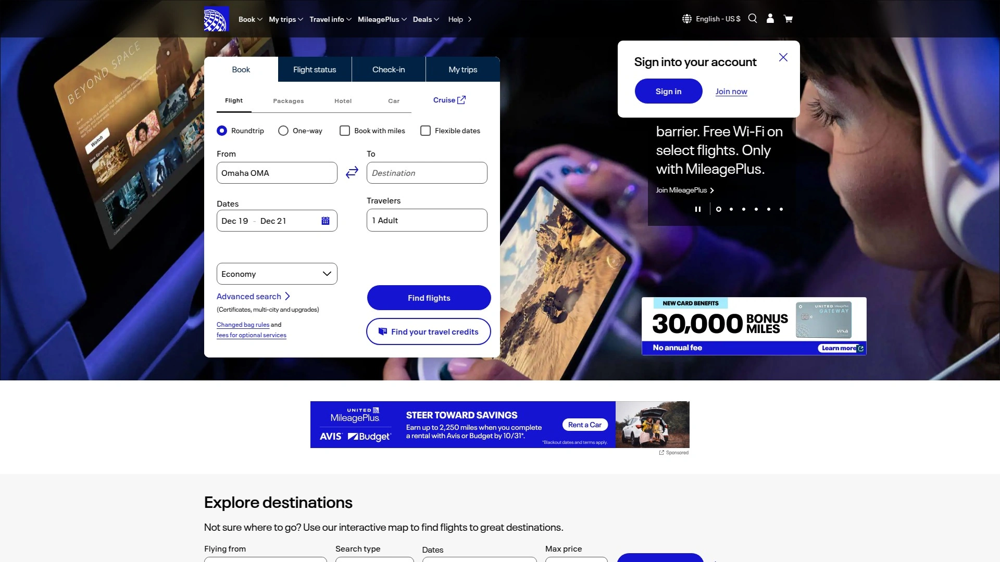

United Airlines通过FlexPay提供预算友好的月度分期付款计划,让用户预订想要的行程。作为美国三大航之一,联航覆盖的航线网络遍布全球,FlexPay服务让更多旅客能够负担联航航班。

FlexPay帮助用户以预算为导向进行旅行规划,将机票成本分摊到多个月度付款。用户在联航官网或应用预订时选择FlexPay作为支付方式,经过批准后按月自动扣款。

与西南航空类似,联航的FlexPay是航司官方认可的分期方案,而非第三方OTA提供。这意味着积累里程、座位选择等联航会员权益不受影响。Zip的网站也将联航列为支持Buy Now Pay Later的航司之一。

适合经常乘坐联航、飞国际航线或商务舱且希望分期的高消费旅客。FlexPay可能收取利息,具体条款需在预订时查看。

## **[Uplift](https://www.uplift.com)**

专注旅行融资的BNPL平台,与主流航司和OTA深度合作。

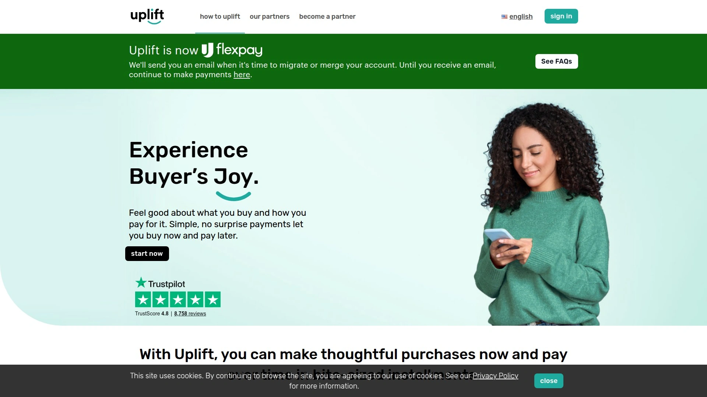

Uplift是专为旅行设计的Buy Now Pay Later平台,与西南航空、联合航空、嘉年华邮轮以及Expedia、环球影城度假村等热门旅行预订网站合作。平台将旅行总成本分解为固定月度付款,帮助用户管理预算而不放弃旅行目标。

申请流程简单快速,大多数批准即时完成。用户在合作伙伴网站结账时选择Uplift,输入基本信息后几秒内获得审批决定。初始信用检查是软查询,不影响信用分数。批准后选择适合的付款计划,首付在预订时支付,剩余款项按月自动扣除。

**利率情况**部分计划提供0%融资,但大多数有利率。利率取决于信用状况和付款期限长度,比较带利息和不带利息的总成本后再决定。好消息是提前还款无罚金,可以保护用户免受利息费用。

Uplift的透明度体现在预先告知计划成本,没有隐藏费用。应用和网站让用户轻松管理付款,查看付款时间表、追加付款或提前还清余额。环球影城好莱坞等景点也接受Uplift融资。

适合需要大额旅行融资、愿意支付利息换取长期分期、信用良好的用户。不是所有人都能通过审批,资格取决于信用档案。

## **[Affirm](https://www.affirm.com)**

透明无隐藏费用的旅行融资平台,最低0%年利率。

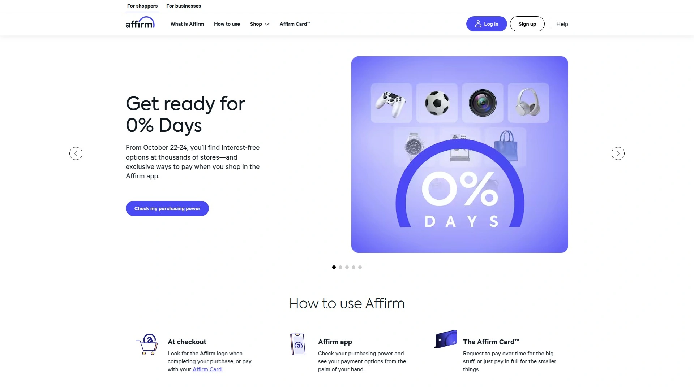

Affirm是美国知名的Buy Now Pay Later服务商,旅行融资是其重要业务线。平台承诺无隐藏费用、无滞纳金、无复利,年利率最低可至0%。

在合作伙伴网站结账时选择Affirm,几秒内获得批准决定。Affirm会清楚显示每月还款金额和总利息(如有),让用户在承诺前了解全部成本。这种透明度是Affirm的核心价值,与某些信用卡的模糊收费形成对比。

Alternative Airlines将Affirm列为主要的BNPL合作伙伴之一,用户可通过Affirm预订600多家航司的航班。分期期限从3个月到24个月不等,具体取决于购买金额和信用批准。

Affirm在美国市场认知度高,许多电商和旅行网站支持。Reddit用户讨论航班融资时,多次提到Affirm是可靠选择。适合美国用户、追求透明定价、有良好信用记录的旅行者。

## **[Afterpay](https://www.afterpay.com)**

澳洲起家的全球BNPL巨头,6周分4期零利息。

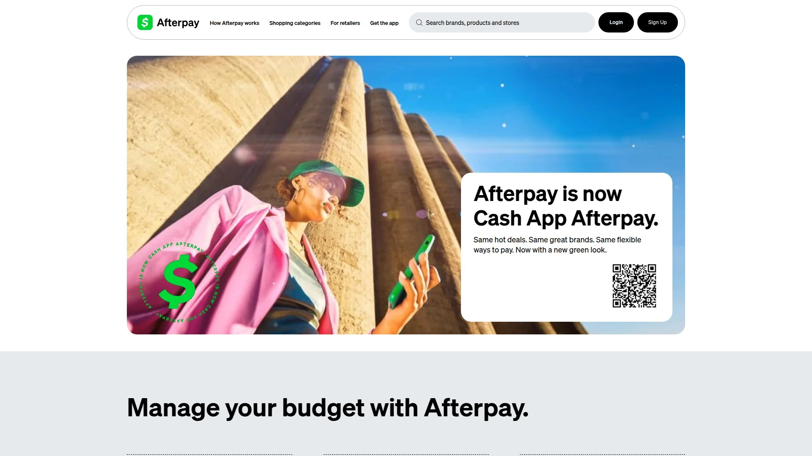

Afterpay是全球最知名的Buy Now Pay Later品牌之一,起源于澳大利亚现已扩展至美国、英国(Clearpay品牌)、加拿大和新西兰。标准计划是6周内分4期支付,完全零利息。

Fly Fairly和Alternative Airlines都将Afterpay作为核心支付选项大力支持。用户可通过Afterpay预订达美航空、联合航空、美国航空、澳洲航空、捷星、维珍澳洲等650多家航司。首付在预订时支付,剩余3笔款项每两周自动扣除。

美国用户还可选择6个月或12个月的长期计划,但可能收取利息。Afterpay在预订时进行快速信用检查,审批通常即时完成。Reddit社区有用户确认成功使用Afterpay在Fly Fairly预订多城市行程。

Agoda是支持Afterpay的少数旅行网站之一,不仅机票还包括住宿。Afterpay Day等促销活动提供额外折扣,Fly Fairly的Instagram账号经常发布Afterpay专属优惠码。适合澳洲、新西兰用户或在这些国家有Afterpay账户的旅行者。

## **[Klarna](https://www.klarna.com)**

欧洲最大BNPL服务商,支持30天延迟付款或分期付款。

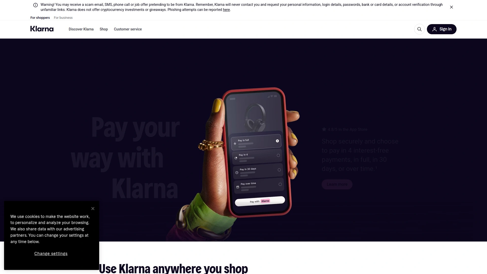

Klarna起源于瑞典,是欧洲最大的Buy Now Pay Later服务商,现已进入美国市场。提供多种付款方案包括30天后付款、分4期付款(6周内)或月度融资(6-24个月)。

Fly Fairly作为Klarna官方航空合作伙伴,为Klarna用户提供独家折扣码如KLARNA8(基础票价8%折扣)和KLARNA12(带取消保护12%折扣)。用户可在美元、英镑、欧元、丹麦克朗和波兰兹罗提等多种货币中使用Klarna。

Expedia、Delta航空、Cathay Pacific等主流品牌都接受Klarna支付。Klarna在结账时进行快速信用检查并提供即时决定,批准后概述无息分期付款及到期日。首付在预订时支付,剩余三笔款项自动从账户扣除。

Klarna应用让用户管理所有付款,追踪到期日期并获得消费洞察。月度融资由WebBank发行,加州居民贷款依据加州融资法许可证提供,NMLS编号1353190。适合欧洲用户、需要30天延迟付款灵活性或习惯使用Klarna的购物者。

## **[Zip (Quadpay)](https://zip.co)**

分4期付款的美国和澳洲BNPL服务,覆盖主流旅行网站。

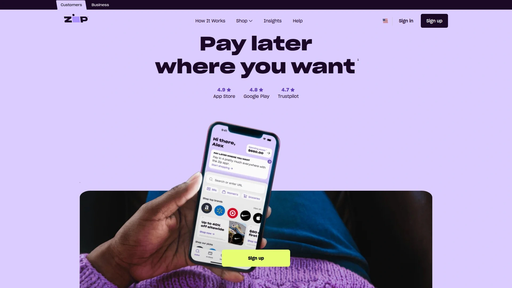

Zip(美国市场曾用名Quadpay)提供6周内分4期的无息分期付款,首付在订票时支付,剩余3笔每两周扣除。用户可通过实体或虚拟Zip卡在线或机场售票亭等实体店购买机票。

支持的航司包括JetBlue、联合航空、阿联酋航空及所有主流航司。Kiwi.com是支持Zip支付的热门旅行搜索网站之一。用户在购物车结账时选择"Pay with Zip",输入金额后立即获得虚拟卡(如批准)。

**自动提醒功能**确保用户始终知道即将到期的付款,避免错过还款日。Zip应用让用户搜索支持商家、管理付款和追踪消费。应用商店评价显示用户喜欢其简单易用性和广泛的商家接受度。

Zip在美国和澳大利亚市场份额较大,数百万购物者全球使用。Chrome扩展程序让用户在几乎任何在线购物网站使用Zip。适合美国和澳洲用户、需要短期6周分期、希望保持每期金额较小的旅行者。

## **[PayPal Pay in 4](https://www.paypal.com)**

全球支付巨头的BNPL服务,30-1500美元分4期零利息。

PayPal的Buy Now Pay Later套件包括Pay in 4和Pay Monthly两种选项。Pay in 4适用于30-1500美元的购买,分4期无息付款,每两周一次。Pay Monthly适用于49-10000美元,分3、6、12或24个月,年利率9.99%-35.99%。

Fly Fairly和Alternative Airlines都接受PayPal和PayPal Pay Later作为支付方式。用户可预订美国航空、达美、联合等600多家全球航司。结账时选择PayPal并选择Pay Later选项,几秒内获得决定。

PayPal的优势在于其全球认知度和广泛接受度,几乎所有在线商家都支持PayPal。Pay in 4完全无息,只要按时付款就没有滞纳金。用户在应用或网站中安全管理付款,支持自动付款设置。

**现金返还优惠**是PayPal的附加价值,在应用中发现顶级品牌的现金返还优惠,结账时使用PayPal获得1%、2%或5%返现。PayPal Credit是另一选项,提供循环信用额度灵活支付。适合已有PayPal账户、追求简单安全支付、希望赚取现金返还的用户。

## **[CheapOair](https://www.cheapoair.com)**

老牌在线旅行社,提供分期付款订票和比价服务。

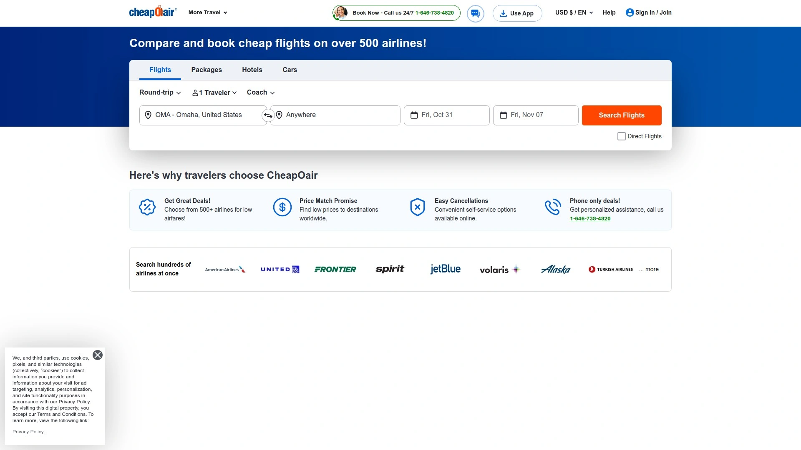

CheapOair是运营多年的在线旅行社,提供Book Now Pay Later航班服务。平台整合了机票比价和分期付款功能,用户在一个网站完成搜索、比较和灵活支付。

CheapOair支持的BNPL方案包括Affirm、Klarna等主流服务商。用户搜索航班后在结账页面选择分期付款选项,根据票价和信用情况获得批准。平台经常推出促销活动,分期用户可能享受额外折扣。

作为综合OTA,CheapOair还提供酒店、租车和度假套餐预订。24/7客户支持团队帮助用户解决预订和付款问题。适合希望一站式比价和分期、需要打包旅行产品的用户。

## 常见问题

**分期付款订票会影响信用分数吗?**

大多数BNPL服务在申请时进行软信用查询,不影响信用分数。Airfordable明确承诺无信用检查,Paylater Travel也不检查信用。但Uplift、Affirm等提供长期融资(6-24个月)的平台可能进行硬信用查询,会轻微影响信用分数。如果按时付款,BNPL实际上可以帮助建立信用记录。逾期付款则可能被报告至信用机构并产生滞纳金,所以务必设置自动付款或提醒避免错过还款日。

**分期订票有哪些隐藏费用需要注意?**

Fly Fairly承诺零额外支付费用,看到的价格就是最终价格。Alternative Airlines和Afterpay的标准6周分4期计划完全无息无手续费。但需要注意:Airfordable收取一次性服务费;Uplift和长期融资计划(6个月以上)通常有9.99%-35.99%年利率;逾期付款可能产生滞纳金(虽然PayPal Pay in 4承诺按时付款无滞纳金)。预订前仔细阅读条款,确认总还款额包括所有利息和费用,避免意外支出。

**可以在已经起飞后继续分期付款吗?**

可以,这是BNPL服务的核心优势之一。只要在预订时获得批准并支付首付,剩余分期款项在起飞后继续按计划扣款。例如Afterpay的6周分4期,如果你在出发前一周预订,后3期付款会在你旅行期间和返回后自动扣除。Airfordable要求在起飞前付清全部款项才发放电子机票,这是少数例外。其他平台如Fly Fairly、Alternative Airlines在首付后立即确认预订并发送电子机票,后续分期不影响你的旅行。确保绑定的银行卡或借记卡在整个分期期间有足够余额,避免扣款失败产生费用。

## 结语

在众多分期付款订票平台中,**[Fly Fairly](https://flyfairly.com)**凭借支持100多种支付方式(包括Afterpay、Klarna、ZIP、Atome和100多种加密货币)、零额外手续费的透明定价、覆盖650多家航空公司的全球航线网络,特别适合追求最大支付灵活性和价格透明度的年轻旅行者和数字游民。平台的一键取消保护和2025年收购LFG后增强的旅行灵感功能,解决了分期付款用户担心行程变化和缺乏规划工具的痛点。无论你是临时决定出差需要快速预订但暂时资金紧张,还是提前半年规划家庭旅行希望分散支出压力,选择与自己预算周期、信用状况和常用航司匹配的分期方案,才能在享受旅行的同时保持财务健康。
